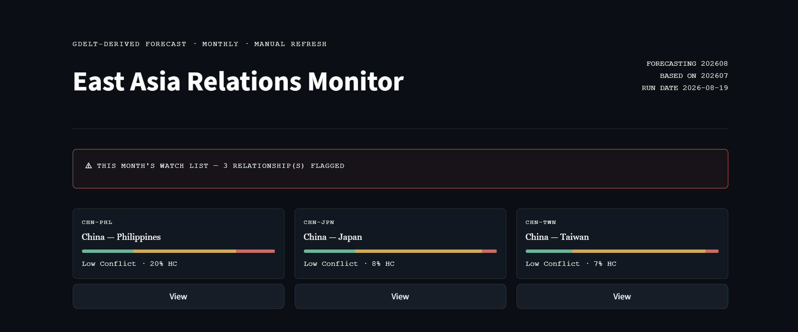
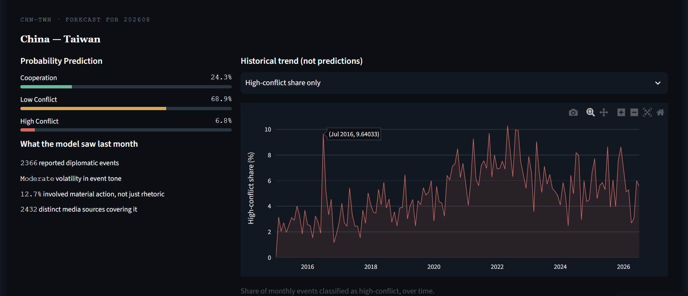

# East Asia Relations Monitor

用 GDELT 事件資料，每月預測東亞 11 組雙邊關係（中日、中台、兩韓等）下個月會偏向合作、低度衝突還是高度衝突(已使用Github Action進行排程)。

最近更新日期:

[**成果網站 →**](https://east-asia-relations-monitor-s4kkyibvoyugw6ik2j6feh.streamlit.app/)

（第一次打開可能要等 10-20 秒喚醒）

---

## 這是什麼

系統會固定監控 11 組東亞雙邊關係，每月更新一次：用「上個月」的完整 資料，預測「這個月」的關係走向，並用模型機率輸出，讓使用者自己判讀風險程度，而不是只給一個死板的分類標籤(但也有作者優化後的分類結果)。

**註：合作、低度衝突、高度衝突的分類依據**

事件層級先依 Goldstein Scale 分類（≥0 合作、-8~0 低度衝突、≤-8 高度衝突，沿用碩論方法）。
月度標籤則用「高度衝突事件佔比」與「低度衝突事件佔比」的分位數門檻判定，
而非單純比較哪個類別事件數量最多——實測發現用筆數直接比較，會讓「合作501筆 vs 低度衝突499筆」這種勢均力敵的情況忽略了衝突風險。

---

## 網站長怎樣

打開網站會先看到「本月關注清單」——被模型判定為高風險的關係會被特別標出來(如下圖)。



點進任何一組關係，可以看到完整的機率分布、過去十年的真實歷史趨勢(如下圖)。




---

## 幾個做的過程裡覺得值得記錄的事

### 1. 用了 90 分位數當「高度衝突」的判定門檻

一開始想說「只要當月出現過一次高度衝突事件，就整月標成高度衝突」，結果實測發現 92% 的月份都會被這樣標記，完全沒有鑑別力。後來改成看「高度衝突事件佔比」的分布，用 90 分位數當門檻，才把真正異常的月份跟一般月份區分開來。

### 2. 加了政體差異這個特徵，結果讓模型變差，但還是決定留著

延續論文的民主和平論的邏輯，加了兩國的 V-Dem 民主分數差異當特徵。結果發現這個特徵的重要性（gain）遠高於其他所有特徵，懷疑模型只是拿它來「認出是哪組國家」而不是真的學到政體差異的效果。用 Leave-One-Dyad-Out 驗證後，發現不同驗證方式給出矛盾的結論——最後決定保留，因為系統最終是輸出機率而非強制分類，AUC 顯示底層判斷力沒有明顯受影響。

### 3. AUC 很高、但直接分類效果很差

調參後 Macro AUC 到 0.92，但用預設 0.5 門檻直接分類，recall 卻只有 0.36 左右。後來才想清楚：AUC 衡量的是「模型排序準不準」，不是「門檻設得好不好」——同一個模型，機率排序能力一直很穩定，只是判斷門檻需要另外調整（threshold tuning），這兩件事要分開處理。

完整的實驗過程、每個決策的數字依據，都寫在 [`DEVELOG.md`](DEVELOG.md)。

---

## 這個系統目前做不到的事

- 只支援這 11 組已訓練過的關係，套用到沒看過的新國家組合，用 Leave-One-Dyad-Out 驗證過，準確度會明顯下降，不建議直接套用(網站亦無顯示其他國家組合的預測)，預計第2版會先擴大至這個亞洲地區，並加入美國作為新的模型。
- 由於把資料壓縮到月為單為，故樣本量有限
- 預測的是「下個月」，不是「這個月剩下的走勢」，未來或可新增週、日為單為的模型

---

## 技術棧

- **資料**：GDELT 2.0（BigQuery）、V-Dem
- **建模**：LightGBM、Optuna
- **驗證**：時間序列切分、Leave-One-Dyad-Out
- **前端**：Streamlit、Plotly

## 專案結構

```
.
├── src/
│   ├── core/                  # shared logic (feature engineering, data fetching)
│   ├── training/               # training-stage scripts (batch fetch, init history, retrain)
│   ├── predict_pipeline.py     # monthly prediction pipeline
│   └── app.py                  # Streamlit app
├── notebooks/                  # full analysis process
└── DEVELOG.md                  # detailed methodology & experiment log
```

## 本機執行

```bash
pip install -r requirements.txt
streamlit run src/app.py
```