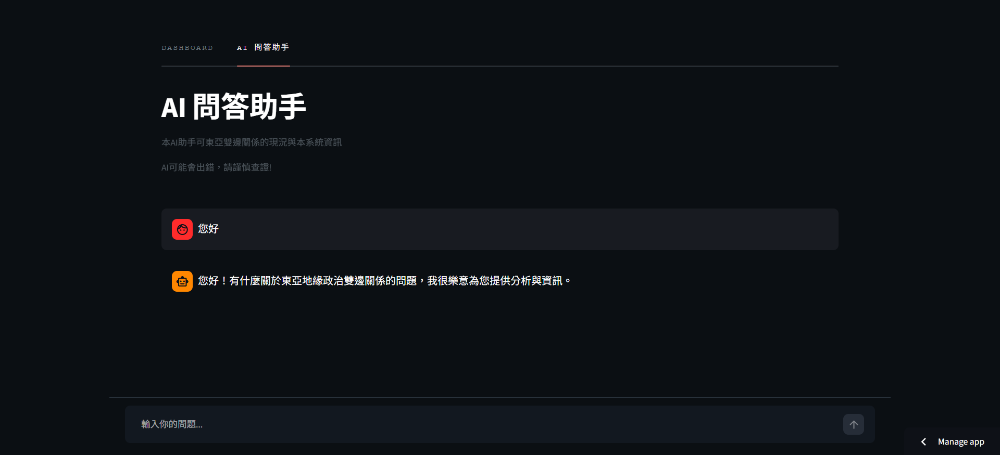

# East Asia Relations Monitor

使用 GDELT 事件資料，每月預測東亞 11 組雙邊關係下個月的互動狀態，分為 **合作、低度衝突、高度衝突** 三類。

系統包含兩個部分：

1. **月度預測**：一套從資料擷取、特徵工程、模型訓練到每月預測的完整機器學習流程。模型使用 LightGBM 產生各雙邊關係的預測機率，再透過 Streamlit 將結果整理成可以直接查看的 Dashboard。
2. **AI 問答助手（RAG Agent）**：一個基於 LangChain 的 Agent，會依問題性質自主決定要查詢預測數據、新聞向量庫或系統說明文件，讓使用者能用自然語言追問「為什麼」與「發生了什麼事」。
(未來打算納入國際關係理論的作為專業知識文獻，使Agent能夠使用理論進行簡單分析)

> **目前系統預測 11 組雙邊關係：** 例如中日、中台、兩韓等。

[**查看成果網站 →**](https://east-asia-relations-monitor-s4kkyibvoyugw6ik2j6feh.streamlit.app/)

第一次開啟網站可能需要等待約 10–20 秒，讓服務重新啟動。

---

## 專案簡介

### 月度預測

系統每月使用前一個月的完整資料，預測下一個月的雙邊關係走向（合作、低度衝突、高度衝突）。

且模型會同時輸出：

- 合作機率
- 低度衝突機率
- 高度衝突機率

使用者可以自己判斷目前的風險程度。例如模型可能認為某組關係有 60% 的低度衝突機率，但同時仍有 25% 的高度衝突機率。這種情況下，比直接顯示「低度衝突」更能保留關係的樣貌。

目前系統主要針對已訓練的 11 組雙邊關係進行預測。

### AI 問答助手

預測數據回答的是「機率多少」，但使用者常常想再追問「為什麼」。

系統因此另外蒐集多國語言的新聞後，建立向量資料庫，並用 LangChain 把三種資料來源（預測數據、新聞、系統說明）整合起來，讓使用者用一般語言就能查詢，回答時同時附上可查證的新聞來源。詳見下方 [AI 問答助手（RAG Agent）](#ai-問答助手rag-agent)。

---

## 系統流程

系統有兩個資料流程，最後都匯入同一個 Streamlit 網站。

```text
預測流程（每月）                          問答流程（每週）
─────────────────                        ─────────────────
GDELT / V-Dem                            Google News RSS（多語言）
      │                                        │  解析轉址、擷取全文
      ▼                                        ▼
資料自動化擷取與整理                        SQLite 
      │                                        │  multilingual-e5-base
      ▼                                        ▼
月度雙邊特徵                               Chroma 向量庫  
      │                                        │
      ▼                                        ▼
LightGBM ─► 三類別機率預測                 LangChain Agent（三個檢索工具）
      │                                        │
      ▼                                        ▼
SQLite predictions 表                     問答結果（附新聞來源網址）
      │                                        │
      └────────────────┬───────────────────────┘
                       ▼
            Streamlit（Dashboard + AI 問答助手）
```

GitHub Actions 負責排程：預測流程每月更新一次，新聞抓取與 embedding 每週更新一次。

---

## Model Evaluation

模型使用時間序列方式切分資料，避免使用未來資料訓練模型後再拿來預測過去。

目前調參後的結果：

| 指標 | 結果 |
|---|---:|
| Macro ROC-AUC | 約 0.92 |
| Recall（threshold = 0.5） | 約 0.36 |
| Validation | Temporal Split |
| Generalization Check | Leave-One-Dyad-Out |

這裡有一個值得特別說明的地方：

**AUC 很高，但直接分類的 recall 並不高。**

這並不是兩個結果互相矛盾。

AUC 主要衡量模型把不同類別的樣本排序開來的能力；而 recall 會受到分類 threshold 的影響。實驗中發現模型的機率排序能力相對穩定，但直接使用預設的 0.5 threshold 並不適合目前的資料分布。

因此目前系統比較重視模型輸出的 **機率分布**，而不是只看最後被分成哪一類。


---

## Dashboard

網站目前主要分成兩個部分。

### 本月關注清單

首頁會列出 11 組雙邊關係，並特別標出模型判定風險較高的關係。


### Dyad Detail

點進單一雙邊關係後，可以查看：

- 三種類別的預測機率
- 過去十年的實際歷史趨勢
- 該組關係的歷史變化


---

## AI 問答助手（RAG Agent）

除了模型預測，系統還整合了一個 **LangChain Agent**，讓使用者可以用自然語言直接提問，例如：

- 「中日關係現在的預測機率是多少？」
- 「最近台海為什麼緊張？」
- 「這個模型是怎麼訓練的？」

Agent 會依問題性質，自己決定要查哪一種資料來源，而不是把所有東西都塞進同一個 prompt。



### 三個檢索工具

| 工具 | 資料來源 | 適合的問題 |
|---|---|---|
| `query_prediction` | SQLite `predictions` 表 | 「現在如何」、「機率多少」這類量化問題 |
| `query_news` | Chroma 向量庫（新聞全文） | 「為什麼」、「發生了什麼事」這類需要背景的問題 |
| `query_system_info` | Chroma 向量庫（系統說明文件） | 「這個系統怎麼做的」、「用了什麼技術」 |

### 詳細流程

```text
Google News RSS（繁中／簡中／英／日／韓／越，依關係差異化選語言）
      │  news_fetch.py：解析轉址取得原文網址 → newspaper3k 擷取全文
      ▼
　　SQLite
      │  rag_embed.py：撈出 embedded = 0 的文章
      ▼
multilingual-e5-base embedding
      │
      ▼
Chroma 向量庫（outputs/chroma_db）
   ├── news_articles  ← 新聞全文，帶 dyad / 標題 / 媒體 / 日期 metadata
   └── system_info    ← docs/about_system.md 依段落切分（embed_system_info.py）
      │
      ▼
LangChain Agent（LLM：Groq openai/gpt-oss-120b，免費額度用盡自動使用 gpt-oss-20b）
      │  format_sources：掃描回答中的 [新聞N] 標記，自動補上 APA 格式參考來源
      ▼
Streamlit 聊天分頁（帶最近數輪對話上下文）
```

---

## 模型診斷與幾個實驗

這個專案過程中，有幾個結果和一開始預期的不太一樣。這些實驗也影響了最後的資料處理與模型設計。

### 1. 高度衝突的標籤不能只看「有沒有發生」

一開始的想法很直接：

> 只要某個月出現過一次高度衝突事件，就把整個月份標成高度衝突。

實際測試後發現，這樣會讓大約 **92% 的月份都被標記為高度衝突**，幾乎失去了鑑別能力。

後來改成觀察每個月「高度衝突事件佔全部事件的比例」，再使用 90 分位數作為門檻。

這樣才比較能把真正異常的月份和一般月份區分開來。

---

### 2. V-Dem 特徵的重要性很高，但不一定代表模型真的學到了政體差異

延續原本碩論研究中的民主和平論，我加入了兩國 V-Dem 民主分數的差異作為特徵。

結果發現，這個特徵的 LightGBM gain 遠高於其他特徵。

一個可能的問題是：

> 模型是不是只是利用這個特徵辨認「這是哪一組國家」，而不是學到政體差異本身和雙邊關係之間的關聯？

因此進一步使用 **Leave-One-Dyad-Out** 進行檢驗。

不同驗證方式得到的結果並不完全一致，所以最後沒有直接把這個特徵刪掉，而是保留它，同時把這個問題記錄為模型限制之一。

目前系統主要輸出的是機率，因此除了單一分類結果之外，也保留模型對不同結果的判斷程度。

---

### 3. AUC 很高，但直接分類效果不理想

調參後 Macro AUC 約為 **0.92**，但使用預設 0.5 threshold 直接分類時，recall 只有約 **0.36**。

這個結果讓我重新檢查了 evaluation 的方式。

後來比較清楚地分開兩件事情：

- **AUC**：模型能不能把不同風險程度的樣本正確排序
- **Threshold**：什麼機率以上才要把它判成某一類

因此，目前不把 0.5 視為理所當然的最佳門檻，而是將模型的 probability output 和最後的 classification threshold 分開處理。

完整的實驗過程與數字紀錄放在 [`DEVELOG.md`](DEVELOG.md)。

---

## Limitations & Future Work

### 目前只支援 11 組已訓練的雙邊關係

目前模型主要針對這 11 組關係進行訓練與預測。

Leave-One-Dyad-Out 驗證顯示，當模型需要預測完全沒看過的新國家組合時，表現會明顯下降。

因此目前網站沒有提供其他國家組合的預測。

下一版預計先擴大到更多亞洲國家，並加入美國作為新的模型對象。

### 月度資料的樣本數有限

目前將事件資料整理成「月」為單位，因此相較於事件層級資料，最終可用的樣本數會少很多。

未來可以進一步評估：

- Weekly model
- Daily model

看看更高頻率的資料是否能提供更多有效訊號。

### 目前只預測下一個月

系統目前回答的是：

> **「下一個月可能發生什麼？」**

而不是：

> **「這個月剩下的時間會怎麼發展？」**

未來可以考慮加入不同預測時間範圍，例如：

- Next week
- Next month
- Next 3 months

---

## 技術棧

| 類別 | 使用技術 |
|---|---|
| Programming | Python |
| Data | GDELT 2.0、BigQuery、V-Dem |
| Machine Learning | LightGBM |
| Hyperparameter Optimization | Optuna |
| Validation | Temporal Split、Leave-One-Dyad-Out |
| Visualization | Plotly |
| Dashboard | Streamlit |
| RAG / Agent | LangChain、Chroma、Groq（gpt-oss-120b / 20b）、HuggingFace Embeddings（multilingual-e5-base）、SQLite |
| News Ingestion | Google News RSS、feedparser、newspaper3k |
| Automation | GitHub Actions |

---

## 專案結構

```
.
├── src/
│   ├── core/                  
│   │   ├── news_fetch.py       # Google News RSS 抓取與全文擷取
│   │   ├── dyad_config.py      # 11 組關係的多語言搜尋關鍵字
│   │   ├── batch_fetch.py      # 批次抓新聞寫入 SQLite
│   │   ├── news_db_writer.py   # articles 資料表建立與寫入
│   │   ├── rag_embed.py        # 新文章 → embedding → Chroma
│   │   ├── agent_tools.py      # 三個 LangChain 檢索工具
│   │   └── agent_core.py       # Agent 組裝、模型 fallback、來源格式化
│   ├── training/               # training-stage scripts (batch fetch, init history, retrain)
│   ├── predict_pipeline.py     # monthly prediction pipeline
│   └── app.py                  # Streamlit app
├── scripts/
│   └── embed_system_info.py    # 把 docs/about_system.md 存入 system_info 向量庫
├── docs/about_system.md        # 系統說明（同時作為 RAG 的知識來源）
├── outputs/
│   ├── relations.db            # SQLite（預測結果、新聞文章）
│   └── chroma_db/              # Chroma 向量庫（news_articles、system_info）
├── notebooks/                  # 建模過程
└── DEVLOG.md                  # 詳細的開發過程和方法論
```

---

## 本機執行

啟用虛擬環境並安裝套件（Windows）：

```bat
.venv\Scripts\activate.bat
pip install -r requirements.txt
```

啟動 Streamlit：

```bash
streamlit run src/app.py
```

### RAG 相關指令

問答助手需要 `.env` 內設定 `GROQ_API_KEY`（新聞抓取與 embedding 另可設定 `HF_TOKEN`）。

```bash
# 抓取本週新聞並寫入 SQLite
python src/core/batch_fetch.py

# 對尚未處理的文章做 embedding，存入 Chroma
python src/core/rag_embed.py

# 更新系統說明知識庫
python scripts/embed_system_info.py

# 在終端機直接和 Agent 對話測試
python src/core/agent_core.py
```

---

## Live Demo

[**East Asia Relations Monitor →**](https://east-asia-relations-monitor-s4kkyibvoyugw6ik2j6feh.streamlit.app/)

第一次開啟可能需要等待約 10–20 秒，讓 Streamlit 服務重新啟動。

---
